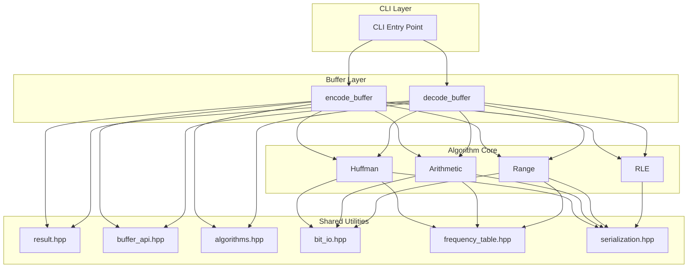

# 系统架构设计

CompressKit 采用清晰的分层架构，确保代码的可维护性、可测试性和一致的内存契约。

## 架构总览



## 分层说明

### 1. CLI Layer（命令行接口）

统一的命令行入口，支持所有算法：

```bash
./build/huffman_cpp encode input.bin output.bin
./build/huffman_cpp decode output.bin decoded.bin
```

**设计亮点**：共享 launcher 消除各算法的 CLI 样板代码。

### 2. Buffer Layer（便捷 API）

围绕 `BufferTransform` 函数指针的无状态封装：

```cpp
#include "compresskit/algorithms.hpp"
#include "compresskit/buffer_api.hpp"

auto result = compresskit::encode_buffer(huffman_encode_buffer, input);
if (result.ok()) { use(result.value); }
```

**特点**：
- 每次调用独立
- 自动体积上限检查（4 GiB 输入，1 GiB 解码输出）
- 统一 `Result<T>`，三种状态码

### 3. Algorithm Core（算法核心）

四种压缩算法的实现：

| 算法 | 文件 | 核心函数 |
|------|------|----------|
| Huffman | `huffman/main.cpp` | `compress_file()`, `decompress_file()` |
| Arithmetic | `arithmetic/main.cpp` | `ArithmeticEncoder`, `ArithmeticDecoder` |
| Range | `range/main.cpp` | `ArithmeticEncoder`, `ArithmeticDecoder` |
| RLE | `rle/main.cpp` | `compress_file()`, `decompress_file()` |

### 4. Shared Utilities（共享工具）

位于 `algorithms/shared/cpp/include/compresskit/` 的跨算法基础设施：

| 头文件 | 功能 |
|--------|----------|
| `result.hpp` | `StatusCode` 枚举与 `Result<T>` 模板 |
| `buffer_api.hpp` | `BufferTransform`、`encode_buffer`、`decode_buffer`、文件辅助 |
| `algorithms.hpp` | 各算法 `*_encode_buffer` / `*_decode_buffer` 入口 |
| `bit_io.hpp` | `BitWriter` / `BitReader` |
| `frequency_table.hpp` | 频率表读写 |
| `serialization.hpp` | 共享魔数/头序列化 |
| `cli_launcher.hpp` | 统一 CLI 分发 |
| `constants.hpp` | 共享命名常量 |

## 二进制格式规范

### 通用结构

```
| Magic (4 bytes) | Header | Payload |
```

### 各算法格式

#### Huffman

```
| HFMN | FreqCount (4B LE) | Frequencies (N×4B LE) | Bitstream |
```

#### Arithmetic

```
| AENC | FreqCount (4B LE) | Frequencies (N×4B LE) | Bitstream |
```

#### Range Coder

```
| RCNC | FreqCount (4B LE) | Frequencies (N×4B LE) | Bytestream |
```

#### RLE

```
| RLE\x00 | RunCount (4B LE) | Runs (Count × (4B + 1B)) |
```

### 频率表格式

- 顺序：符号 0-255（字节值），符号 256（EOF）
- 字节序：小端序（Little-Endian）
- 总大小：4 字节（符号计数）+ 257 × 4 字节 = 1032 字节

## 安全边界

| 限制 | 值 | 目的 |
|------|-----|------|
| 输入大小上限 | 4 GiB | 防止频率溢出和解压缩炸弹攻击 |
| 输出大小上限（仅解码） | 1 GiB | 防止解压缩炸弹攻击 |

## Deep Module 设计

CompressKit 遵循 Deep Module 原则：

```
Deep Module = 简单接口 + 复杂实现

encode_buffer(transform, input) -> Result<bytes>
    ↓
隐藏的复杂性：
- 体积上限强制
- 错误传播
- 位对齐
- 频率表序列化
```

**好处**：
- 用户只需理解简单接口
- 内部复杂性不影响用户代码
- 易于测试和维护
