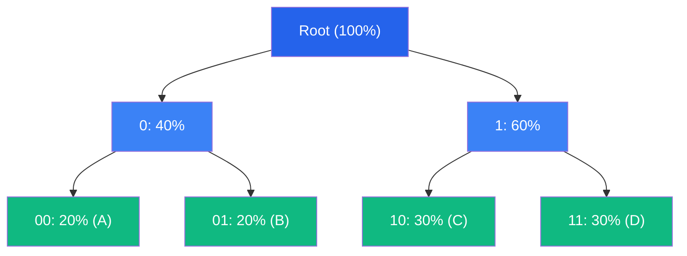

# Huffman Coding Deep Dive

Huffman coding is one of the most classic lossless compression algorithms, proposed by David A. Huffman in 1952. This article provides a comprehensive analysis from mathematical principles to engineering implementation.

## Historical Background

In 1952, David A. Huffman was pursuing his doctoral degree at MIT when his advisor Robert Fano assigned a topic: finding the optimal prefix coding method. Huffman abandoned the mainstream top-down approach of the time and instead adopted a bottom-up greedy strategy, ultimately discovering the algorithm that bears his name.[^1]

## Mathematical Foundation

### Information Entropy

Given a source symbol set $S = \{s_1, s_2, ..., s_n\}$ with probability distribution $P = \{p_1, p_2, ..., p_n\}$, information entropy is defined as:

$$
H(P) = -\sum_{i=1}^{n} p_i \log_2 p_i
$$

**Meaning of Entropy**: Represents the average information content per symbol, and also the theoretical lower bound for lossless compression.

### Prefix Codes

A prefix code is a special encoding where no codeword is a prefix of another. This guarantees unique decodability.

**Example**: `{0, 10, 11}` is a prefix code, but `{0, 01, 11}` is not (`0` is a prefix of `01`).

### Optimal Prefix Code

An optimal prefix code minimizes the average code length:

$$
L = \sum_{i=1}^{n} p_i \cdot l_i
$$

Where $l_i$ is the code length for symbol $s_i$.

## Algorithm Principles

### Core Idea

Huffman's algorithm uses a **greedy strategy**: repeatedly merge the two nodes with the smallest probabilities to build a binary tree.

### Algorithm Steps

1. Create a leaf node for each symbol with weight = probability/frequency
2. Repeat until only one node remains:
   - Select the two nodes with smallest weights
   - Create a new node as their parent
   - New node weight = sum of two children's weights
3. The path from root to leaf determines the code (left=0, right=1)

### Correctness Proof

**Lemma**: Let $x$ and $y$ be the two symbols with the smallest probabilities. There exists an optimal prefix code where $x$ and $y$ have the same code length and differ only in the last bit.

**Proof**: Let $a$ and $b$ be the two deepest leaves in the optimal code. If $x$ is not $a$, swapping $x$ and $a$ does not increase the average code length (since $p_x \leq p_a$). Similarly, we can swap $y$ and $b$. ∎

## Implementation Details

### Tree Building Algorithm

```go
func buildHuffmanTree(freqs map[byte]int) *Node {
    // Use a min-heap
    h := &minHeap{}
    for sym, freq := range freqs {
        heap.Push(h, &Node{Symbol: sym, Freq: freq})
    }
    
    // Merge until only one node remains
    for h.Len() > 1 {
        left := heap.Pop(h).(*Node)
        right := heap.Pop(h).(*Node)
        parent := &Node{
            Freq:  left.Freq + right.Freq,
            Left:  left,
            Right: right,
        }
        heap.Push(h, parent)
    }
    
    return heap.Pop(h).(*Node)
}
```

### Code Table Generation

```go
func generateCodes(root *Node, code string, codes map[byte]string) {
    if root == nil {
        return
    }
    
    if root.Left == nil && root.Right == nil {
        // Leaf node: save the code
        codes[root.Symbol] = code
        return
    }
    
    // Recursively generate codes for left and right subtrees
    generateCodes(root.Left, code+"0", codes)
    generateCodes(root.Right, code+"1", codes)
}
```

### Edge Cases

| Case | Handling Method |
|------|-----------------|
| Empty input | Return predefined error code |
| Single symbol | Special handling: code length = 1, code = `0` |
| Equal probabilities | Degrades to fixed-length coding |
| Zero frequency | Skip the symbol |

### Determinism Guarantee

To ensure cross-language binary compatibility, when frequencies are equal, sort by symbol value:

```go
// Comparison function
func (h *minHeap) Less(i, j int) bool {
    if h.nodes[i].Freq == h.nodes[j].Freq {
        return h.nodes[i].Symbol < h.nodes[j].Symbol
    }
    return h.nodes[i].Freq < h.nodes[j].Freq
}
```

## Binary Format

CompressKit's Huffman encoding output format:

```
| Magic (4 bytes) | Freq Count (4 bytes LE) | Frequencies (N × 4 bytes LE) | Bitstream |
```

- **Magic**: `HFMN` (0x48 0x46 0x4D 0x4E)
- **Freq Count**: Number of symbols (N)
- **Frequencies**: Frequency per symbol (little-endian)
- **Bitstream**: Encoded bit stream

## Performance Analysis

### Time Complexity

| Operation | Complexity | Description |
|-----------|------------|-------------|
| Tree building | O(σ log σ) | σ = alphabet size (256) |
| Code generation | O(σ) | Visit all leaf nodes |
| Encoding | O(n) | n = input length |
| Decoding | O(n) | Constant time per symbol |

### Space Complexity

- **Encoder**: O(σ) for code table
- **Decoder**: O(σ) for decode tree

### Measured Performance

| Language | Encoding Speed | Decoding Speed | Memory Usage |
|----------|---------------|----------------|--------------|
| Rust | 387 MB/s | 456 MB/s | 1.5 MB |
| C++ | 312 MB/s | 398 MB/s | 1.8 MB |
| Go | 245 MB/s | 312 MB/s | 2.1 MB |

## Comparison with Other Algorithms

### Advantages

- ✅ Fast encoding and decoding
- ✅ Simple implementation
- ✅ Theoretical guarantee: optimal prefix code

### Disadvantages

- ❌ Code length must be integer (less efficient than arithmetic coding)
- ❌ Need to store frequency table (overhead for small files)

### Best Use Cases

- Speed-priority scenarios
- Real-time compression/decompression
- Embedded devices

## Visualization



Encoding result: A=00, B=01, C=10, D=11

## Further Reading

- [Arithmetic Coding](/en/algorithms/arithmetic) - Approaching the entropy limit
- [Range Coding](/en/algorithms/range) - Integer-based arithmetic coding
- [Streaming API](/en/api/streaming) - Core of the Streaming API

## References

[^1]: Huffman, D. A. (1952). "A Method for the Construction of Minimum-Redundancy Codes". *Proceedings of the IRE*. 40 (9): 1098–1101. [DOI:10.1109/JRPROC.1952.273898](https://doi.org/10.1109/JRPROC.1952.273898)

[^2]: Sayood, K. (2017). *Introduction to Data Compression*. Morgan Kaufmann. ISBN 978-0-12-809474-7.
