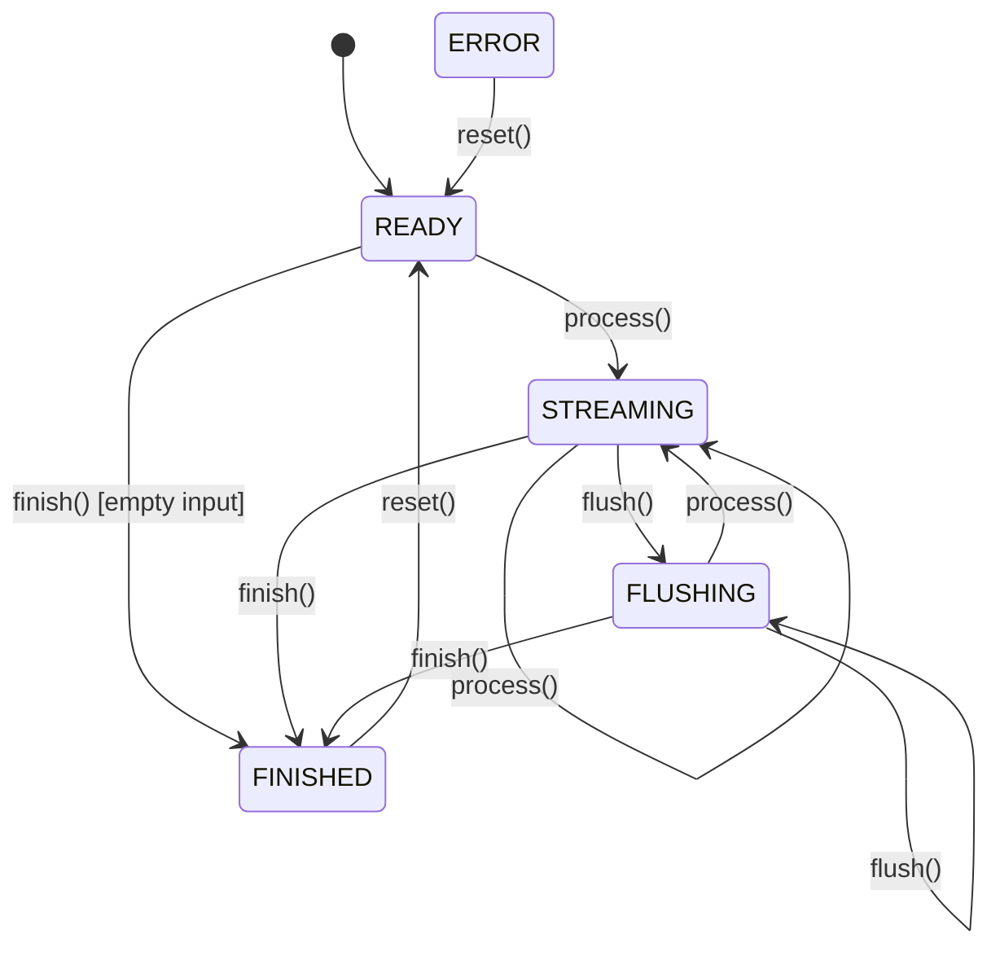

# State Machine Design Philosophy

The core of CompressKit's Streaming API is a carefully designed **5-state finite state machine**. This article provides an in-depth analysis of its design principles, state transition rules, and error handling strategies.

## Design Motivation

### Why State Machine?

Traditional "one-shot encoding" APIs have obvious problems for large file processing:

| Problem | Impact |
|---------|--------|
| Memory usage | Must load entire file into memory |
| Latency | Cannot implement streaming processing |
| Recoverability | Cannot continue from breakpoint after failure |

Streaming API solves these problems through a state machine:

- ✅ **Incremental processing**: Supports chunked input
- ✅ **Memory efficiency**: Fixed-size buffer
- ✅ **Transactional**: Errors don't corrupt internal state

## 5-State Definition



### State Descriptions

| State | Meaning | Typical Scenario |
|-------|---------|------------------|
| `READY` | Initial state, waiting for input | Encoder just created |
| `STREAMING` | Processing data | Continuous `process()` calls |
| `FLUSHING` | Flushing buffer | After `flush()` call |
| `FINISHED` | Processing complete | After `finish()` call |
| `ERROR` | Error state | Unrecoverable error occurred |

## State Transition Rules

### Complete Transition Table

```
┌─────────────┬────────────────────────────────────────────────────────────┐
│ State       │ Valid Operations                                           │
├─────────────┼────────────────────────────────────────────────────────────┤
│ READY       │ process() → STREAMING                                      │
│             │ flush()    → READY (no-op)                                 │
│             │ finish()   → FINISHED (empty input)                        │
│             │ reset()    → READY                                         │
├─────────────┼────────────────────────────────────────────────────────────┤
│ STREAMING   │ process() → STREAMING                                      │
│             │ flush()    → FLUSHING                                      │
│             │ finish()   → FINISHED                                      │
│             │ reset()    → READY                                         │
├─────────────┼────────────────────────────────────────────────────────────┤
│ FLUSHING    │ process() → STREAMING                                      │
│             │ flush()    → FLUSHING (idempotent)                         │
│             │ finish()   → FINISHED                                      │
│             │ reset()    → READY                                         │
├─────────────┼────────────────────────────────────────────────────────────┤
│ FINISHED    │ reset()    → READY                                         │
│             │ (any other) → ERROR                                        │
├─────────────┼────────────────────────────────────────────────────────────┤
│ ERROR       │ reset()    → READY                                         │
│             │ (any other) → ERROR (return ERR_INVALID_STATE)             │
└─────────────┴────────────────────────────────────────────────────────────┘
```

## Error Handling Strategy

### Error Types

```cpp
enum class ErrorKind {
    BufTooSmall,          // Output buffer insufficient
    Truncated,            // Input stream ended prematurely
    Corrupt,              // Data corrupted or checksum failed
    InvalidState,         // Current state doesn't support this operation
    SizeLimit,            // Exceeded safety limits
    VersionUnsupported,   // Unsupported version
    UnknownAlgo,          // Unknown algorithm identifier
    IO,                   // I/O error
};
```

### Transactional Guarantee

**Key Design Decision**: When `ErrBufTooSmall` is returned, the internal state **remains unchanged**.

This means the caller can:

1. Allocate a larger buffer
2. Retry the operation
3. No need to reset the entire encoder

```cpp
// Usage example
std::vector<uint8_t> output(initialSize);
while (true) {
    auto result = encoder.process(input);
    if (result.error == ErrorKind::BufTooSmall) {
        // State unchanged, safe to retry
        output.resize(output.size() * 2);
        continue;
    }
    break;
}
```

## Buffer Layer Wrapper

To simplify usage, CompressKit provides a Buffer Layer:

```
┌─────────────────────────────────────────────────────────────────┐
│                      Buffer Layer                               │
│           (EncodeBuffer/DecodeBuffer - stateless wrapper)       │
├─────────────────────────────────────────────────────────────────┤
│                     Streaming Layer                             │
│            (process/flush/finish/reset - 5-state FSM)           │
├─────────────────────────────────────────────────────────────────┤
│                     Algorithm Core                              │
│         (Huffman/Arithmetic/Range/RLE implementations)          │
└─────────────────────────────────────────────────────────────────┘
```

## Further Reading

- [Streaming API Reference](/en/api/streaming) - Complete API documentation
- [Architecture Design](/en/architecture/) - Binary protocol design
