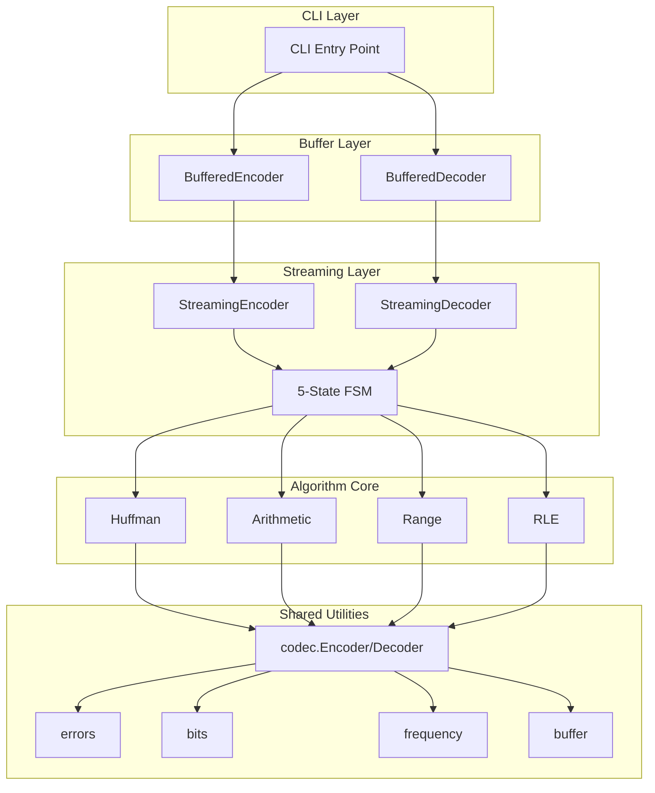

# System Architecture Design

CompressKit employs a clear layered architecture ensuring code maintainability, testability, and a consistent in-memory contract.

## Architecture Overview



## Layer Descriptions

### 1. CLI Layer

Unified command-line entry supporting all algorithms:

```bash
./build/huffman_cpp encode input.bin output.bin
./build/huffman_cpp decode output.bin decoded.bin
```

**Design highlight**: 94% boilerplate reduction through unified launcher.

### 2. Buffer Layer

Stateless convenience wrapper for simple use cases:

```cpp
// C++ example
auto encoder = compresskit::make_huffman_encoder();
auto output = compresskit::encode_buffer(encoder, input);
```

**Features**:
- Each call is independent
- Automatic buffer management
- Simplified error handling

### 3. Streaming Layer

Core state machine implementation supporting incremental processing:

```cpp
auto encoder = compresskit::make_huffman_encoder();

// Incremental processing
encoder->process(chunk1);
encoder->process(chunk2);
encoder->process(chunk3);

// Finish and get result
auto output = encoder->finish();
```

**Features**:
- 5-state finite state machine
- Transactional error handling
- Flush and reset support

### 4. Algorithm Core

Implementations of four compression algorithms:

| Algorithm | File | Core Functions |
|-----------|------|----------------|
| Huffman | `huffman/main.cpp` | `encodeBlock()`, `buildTree()` |
| Arithmetic | `arithmetic/main.cpp` | `encodeSymbol()`, `normalize()` |
| Range | `range/main.cpp` | `encodeSymbol()`, `shiftBytes()` |
| RLE | `rle/main.cpp` | `encodeRun()` |

### 5. Shared Utilities

Cross-algorithm shared infrastructure:

| Module | Function |
|--------|----------|
| `codec` | Encoder/Decoder interface definitions |
| `errors` | Unified error types and codes |
| `bits` | Bit writer/reader |
| `frequency` | Frequency table processing |
| `buffer` | Buffer management |

## Binary Format Specification

### Common Structure

```
| Magic (4 bytes) | Header | Payload |
```

### Frequency Table Format

- Order: symbols 0-255 (byte values), symbol 256 (EOF)
- Byte order: Little-Endian
- Total size: 4 bytes (symbol count) + 257 × 4 bytes = 1032 bytes

## Security Boundaries

| Limit | Value | Purpose |
|-------|-------|---------|
| Max input size | 4 GiB | Prevent frequency overflow and decompression bomb attacks |
| Max output size (decode only) | 1 GiB | Prevent decompression bomb attacks |

## Deep Module Design

CompressKit follows the Deep Module principle:

```
Deep Module = Simple interface + Complex implementation

BufferedEncoder.Encode(input) → output
    ↓
Hidden complexity:
- State machine management
- Buffer expansion
- Error handling
- Bit alignment
```

## Further Reading

- [Streaming API](/en/api/streaming) - 5-state FSM details and complete API documentation
