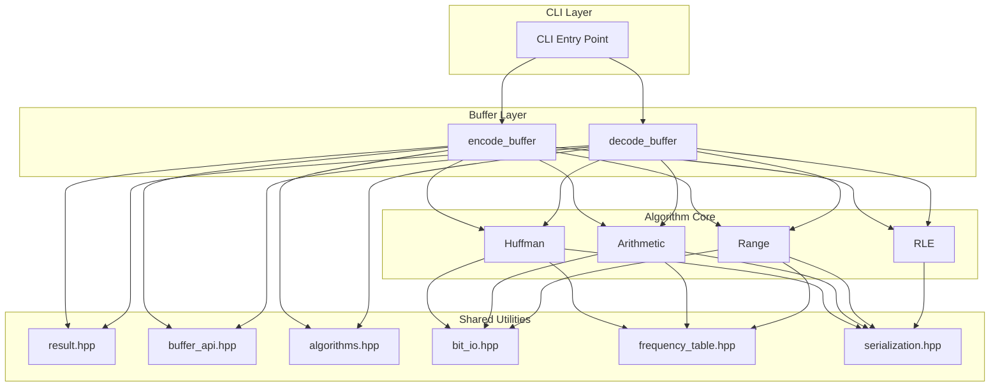

# System Architecture Design

CompressKit employs a clear layered architecture ensuring code maintainability, testability, and a consistent in-memory contract.

## Architecture Overview



## Layer Descriptions

### 1. CLI Layer

Unified command-line entry supporting all algorithms:

```bash
./build/huffman_cpp encode input.bin output.bin
./build/huffman_cpp decode output.bin decoded.bin
```

**Design highlight**: shared launcher eliminates per-algorithm CLI boilerplate.

### 2. Buffer Layer

Stateless convenience wrapper around a `BufferTransform` function pointer:

```cpp
#include "compresskit/algorithms.hpp"
#include "compresskit/buffer_api.hpp"

auto result = compresskit::encode_buffer(huffman_encode_buffer, input);
if (result.ok()) { use(result.value); }
```

**Features**:
- Each call is independent
- Automatic size-limit checks (4 GiB input, 1 GiB decoded output)
- Uniform `Result<T>` with three status codes

### 3. Algorithm Core

Implementations of four compression algorithms:

| Algorithm | File | Core Functions |
|-----------|------|----------------|
| Huffman | `huffman/main.cpp` | `compress_file()`, `decompress_file()` |
| Arithmetic | `arithmetic/main.cpp` | `ArithmeticEncoder`, `ArithmeticDecoder` |
| Range | `range/main.cpp` | `ArithmeticEncoder`, `ArithmeticDecoder` |
| RLE | `rle/main.cpp` | `compress_file()`, `decompress_file()` |

### 4. Shared Utilities

Cross-algorithm shared infrastructure under `algorithms/shared/cpp/include/compresskit/`:

| Header | Function |
|--------|----------|
| `result.hpp` | `StatusCode` enum and `Result<T>` template |
| `buffer_api.hpp` | `BufferTransform`, `encode_buffer`, `decode_buffer`, file helpers |
| `algorithms.hpp` | per-algorithm `*_encode_buffer` / `*_decode_buffer` entry points |
| `bit_io.hpp` | `BitWriter` / `BitReader` |
| `frequency_table.hpp` | frequency table read/write |
| `serialization.hpp` | shared magic/header serialization |
| `cli_launcher.hpp` | unified CLI dispatch |
| `constants.hpp` | shared named constants |

## Binary Format Specification

### Common Structure

```
| Magic (4 bytes) | Header | Payload |
```

### Frequency Table Format

- Order: symbols 0-255 (byte values), symbol 256 (EOF)
- Byte order: Little-Endian
- Total size: 4 bytes (symbol count) + 257 × 4 bytes = 1032 bytes

## Security Boundaries

| Limit | Value | Purpose |
|-------|-------|---------|
| Max input size | 4 GiB | Prevent frequency overflow and decompression bomb attacks |
| Max output size (decode only) | 1 GiB | Prevent decompression bomb attacks |

## Deep Module Design

CompressKit follows the Deep Module principle:

```
Deep Module = Simple interface + Complex implementation

encode_buffer(transform, input) -> Result<bytes>
    ↓
Hidden complexity:
- Size-limit enforcement
- Error propagation
- Bit alignment
- Frequency table serialization
```
