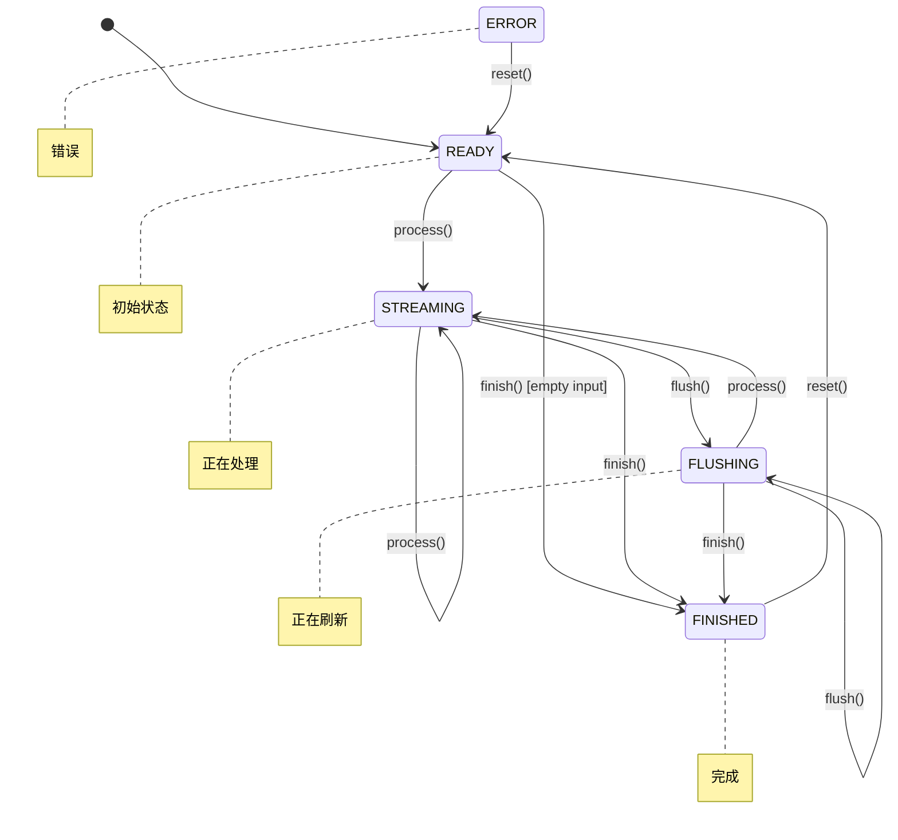

# 状态机设计哲学

CompressKit 的 Streaming API 核心是一个精心设计的 **5 状态有限状态机**。本文将深入解析其设计原理、状态转换规则和错误处理策略。

## 设计动机

### 为什么需要状态机？

传统的"一次性编码"API 对于大文件处理存在明显问题：

| 问题 | 影响 |
|------|------|
| 内存占用 | 必须将整个文件加载到内存 |
| 延迟 | 无法实现流式处理 |
| 可恢复性 | 失败后无法从断点继续 |

Streaming API 通过状态机解决了这些问题：

- ✅ **增量处理**：支持分块输入
- ✅ **内存效率**：固定大小的缓冲区
- ✅ **事务性**：错误不破坏内部状态

## 5 状态定义



### 状态说明

| 状态 | 含义 | 典型场景 |
|------|------|----------|
| `READY` | 初始状态，等待输入 | 编码器刚创建 |
| `STREAMING` | 正在处理数据 | 持续调用 `process()` |
| `FLUSHING` | 正在刷新缓冲区 | 调用 `flush()` 后 |
| `FINISHED` | 处理完成 | 调用 `finish()` 后 |
| `ERROR` | 错误状态 | 发生不可恢复错误 |

## 状态转换规则

### 完整转换表

```
┌─────────────┬────────────────────────────────────────────────────────────┐
│ State       │ Valid Operations                                           │
├─────────────┼────────────────────────────────────────────────────────────┤
│ READY       │ process() → STREAMING                                      │
│             │ flush()    → READY (no-op)                                 │
│             │ finish()   → FINISHED (empty input)                        │
│             │ reset()    → READY                                         │
├─────────────┼────────────────────────────────────────────────────────────┤
│ STREAMING   │ process() → STREAMING                                      │
│             │ flush()    → FLUSHING                                      │
│             │ finish()   → FINISHED                                      │
│             │ reset()    → READY                                         │
├─────────────┼────────────────────────────────────────────────────────────┤
│ FLUSHING    │ process() → STREAMING                                      │
│             │ flush()    → FLUSHING (idempotent)                         │
│             │ finish()   → FINISHED                                      │
│             │ reset()    → READY                                         │
├─────────────┼────────────────────────────────────────────────────────────┤
│ FINISHED    │ reset()    → READY                                         │
│             │ (any other) → ERROR                                        │
├─────────────┼────────────────────────────────────────────────────────────┤
│ ERROR       │ reset()    → READY                                         │
│             │ (any other) → ERROR (return ERR_INVALID_STATE)             │
└─────────────┴────────────────────────────────────────────────────────────┘
```

### Go 实现

```go
type State int

const (
    StateReady State = iota
    StateStreaming
    StateFlushing
    StateFinished
    StateError
)

func (e *Encoder) Process(input []byte) error {
    if e.state == StateFinished || e.state == StateError {
        e.state = StateError
        return ErrInvalidState
    }
    
    // 处理数据...
    e.state = StateStreaming
    return nil
}

func (e *Encoder) Finish() ([]byte, error) {
    if e.state == StateFinished || e.state == StateError {
        if e.state == StateError {
            return nil, ErrInvalidState
        }
        return nil, nil // 幂等性
    }
    
    // 完成处理...
    e.state = StateFinished
    return e.output, nil
}

func (e *Encoder) Reset() {
    e.state = StateReady
    // 重置内部缓冲区...
}
```

## 错误处理策略

### 错误类型

```go
type ErrorKind int

const (
    KindBufTooSmall     // 输出缓冲区不足
    KindTruncated       // 输入流过早结束
    KindCorrupt         // 数据损坏或校验失败
    KindInvalidState    // 当前状态不支持此操作
    KindSizeLimit       // 超过安全限制
    KindVersionUnsupported  // 不支持的版本
    KindUnknownAlgo     // 未知的算法标识
    KindIO              // I/O 错误
)
```

### 事务性保证

**关键设计决策**：当 `ErrBufTooSmall` 返回时，内部状态**保持不变**。

这意味着调用者可以：

1. 分配更大的缓冲区
2. 重试操作
3. 不需要重置整个编码器

```go
// 使用示例
output := make([]byte, initialSize)
for {
    n, err := encoder.Process(input)
    if err == ErrBufTooSmall {
        // 状态不变，可以安全重试
        output = make([]byte, len(output)*2)
        continue
    }
    break
}
```

## Buffer Layer 封装

为了简化使用，CompressKit 提供了 Buffer Layer：

```
┌─────────────────────────────────────────────────────────────────┐
│                      Buffer Layer                               │
│           (EncodeBuffer/DecodeBuffer - stateless wrapper)       │
├─────────────────────────────────────────────────────────────────┤
│                     Streaming Layer                             │
│            (process/flush/finish/reset - 5-state FSM)           │
├─────────────────────────────────────────────────────────────────┤
│                     Algorithm Core                              │
│         (Huffman/Arithmetic/Range/RLE implementations)          │
└─────────────────────────────────────────────────────────────────┘
```

### Buffer Layer 特点

- **无状态**：每次调用都是独立的
- **自动缓冲**：内部处理缓冲区扩展
- **简化 API**：`Encode(input) → output`

```go
// Buffer Layer 使用示例
encoder := huffman.NewBufferedEncoder()
output, err := encoder.Encode(input)  // 一次调用完成
```

## 跨语言一致性

状态机设计在三种语言中完全一致：

| 语言 | 状态定义 | 转换规则 | 错误码 |
|------|----------|----------|--------|
| Go | ✅ 相同 | ✅ 相同 | ✅ 相同 |
| Rust | ✅ 相同 | ✅ 相同 | ✅ 相同 |
| C++ | ✅ 相同 | ✅ 相同 | ✅ 相同 |

### 测试验证

通过 **7 个生命周期测试用例** 验证状态机行为：

```
L1: READY → process → STREAMING → finish → FINISHED
L2: READY → process → STREAMING → process → STREAMING → finish
L3: READY → process → STREAMING → flush → FLUSHING → finish
L4: READY → finish (empty) → FINISHED
L5: FINISHED → reset → READY
L6: FINISHED → process → ERROR
L7: ERROR → reset → READY
```

## 设计权衡

### 为什么不是更多状态？

考虑过添加更多细粒度状态（如 `ENCODING_HEADER`, `ENCODING_BODY`），但：

- ❌ 增加复杂度
- ❌ 用户需要理解更多状态
- ✅ 5 状态足够表达所有生命周期

### 为什么不是更少状态？

考虑过合并 `FLUSHING` 和 `STREAMING`，但：

- ❌ 无法区分"正在处理"和"正在刷新"
- ✅ 分开可以提供更精确的状态查询

## 扩展阅读

- [Streaming API 参考](/zh/api/streaming) - 完整 API 文档
- [跨语言兼容](/zh/guide/architecture) - 二进制协议设计
- [测试策略](/zh/testing/cross-language) - 一致性验证方法
