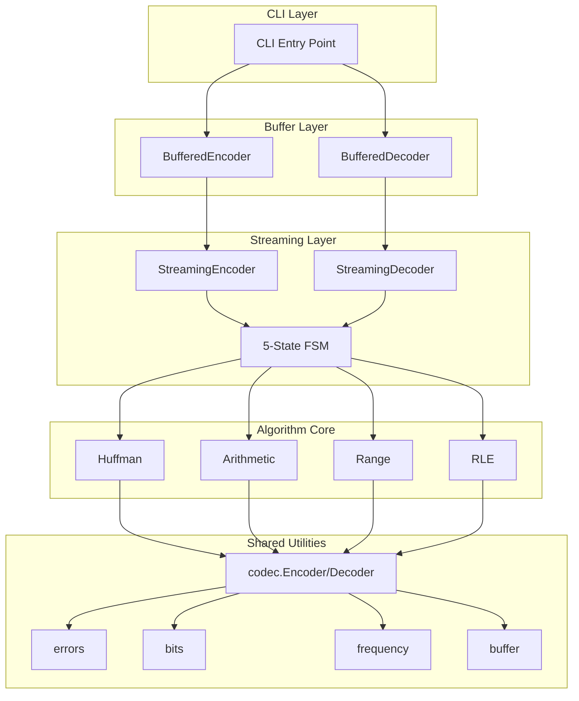

# 系统架构设计

CompressKit 采用清晰的分层架构，确保代码的可维护性、可测试性和跨语言一致性。

## 架构总览



## 分层说明

### 1. CLI Layer（命令行接口）

统一的命令行入口，支持所有算法和语言：

```bash
compress-kit encode --algo huffman --lang go input.bin output.bin
compress-kit decode --algo huffman --lang rust output.bin decoded.bin
```

**设计亮点**：94% 的样板代码削减，通过统一 launcher 实现。

### 2. Buffer Layer（便捷 API）

无状态的便捷封装，适合简单场景：

```go
// Go 示例
encoder := huffman.NewBufferedEncoder()
output, err := encoder.Encode(input)
```

```rust
// Rust 示例
let encoder = huffman::BufferedEncoder::new();
let output = encoder.encode(&input)?;
```

**特点**：
- 每次调用独立
- 自动缓冲区管理
- 简化的错误处理

### 3. Streaming Layer（流式 API）

核心的状态机实现，支持增量处理：

```go
encoder := huffman.NewStreamingEncoder()

// 增量处理
encoder.Process(chunk1)
encoder.Process(chunk2)
encoder.Process(chunk3)

// 完成并获取结果
output, err := encoder.Finish()
```

**特点**：
- 5 状态有限状态机
- 事务性错误处理
- 支持刷新和重置

### 4. Algorithm Core（算法核心）

四种压缩算法的实现：

| 算法 | 文件 | 核心函数 |
|------|------|----------|
| Huffman | `huffman/encode.go` | `encodeBlock()`, `buildTree()` |
| Arithmetic | `arithmetic/encode.go` | `encodeSymbol()`, `normalize()` |
| Range | `range/encode.go` | `encodeSymbol()`, `shiftBytes()` |
| RLE | `rle/encode.go` | `encodeRun()` |

### 5. Shared Utilities（共享工具）

跨算法共享的基础设施：

| 模块 | 功能 |
|------|------|
| `codec` | 编码器/解码器接口定义 |
| `errors` | 统一的错误类型和错误码 |
| `bits` | 位写入器/读取器 |
| `frequency` | 频率表处理 |
| `buffer` | 缓冲区管理 |

## 模块依赖规则

```
依赖方向：上层 → 下层

允许的依赖：
✅ CLI → Buffer → Streaming → Core → Shared

禁止的依赖：
❌ Core → Buffer
❌ Core → CLI
❌ Shared → 任何上层模块
```

## 二进制格式规范

### 通用结构

```
| Magic (4 bytes) | Header | Payload |
```

### 各算法格式

#### Huffman

```
| HFMN | FreqCount (4B LE) | Frequencies (N×4B LE) | Bitstream |
```

#### Arithmetic

```
| AENC | FreqCount (4B LE) | Frequencies (N×4B LE) | Bitstream |
```

#### Range Coder

```
| RCNC | FreqCount (4B LE) | Frequencies (N×4B LE) | Bytestream |
```

#### RLE

```
| RLE\x00 | RunCount (4B LE) | Runs (Count × (4B + 1B)) |
```

### 频率表格式

**跨语言统一**：

- 顺序：符号 0-255（字节值），符号 256（EOF）
- 字节序：小端序（Little-Endian）
- 总大小：4 字节（符号计数）+ 257 × 4 字节 = 1032 字节

## 安全边界

| 限制 | 值 | 目的 |
|------|-----|------|
| 输入大小上限 | 4 GiB | 防止频率溢出和解压缩炸弹攻击 |
| 输出大小上限（仅解码） | 1 GiB | 防止解压缩炸弹攻击 |

## Deep Module 设计

CompressKit 遵循 Deep Module 原则：

```
Deep Module = 简单接口 + 复杂实现

BufferedEncoder.Encode(input) → output
    ↓
隐藏的复杂性：
- 状态机管理
- 缓冲区扩展
- 错误处理
- 位对齐
```

**好处**：
- 用户只需理解简单接口
- 内部复杂性不影响用户代码
- 易于测试和维护

## 扩展阅读

- [状态机设计](/zh/academy/state-machine) - 5 状态 FSM 详解
- [Streaming API](/zh/api/streaming) - 完整 API 文档
- [跨语言测试](/zh/testing/cross-language) - 一致性验证
